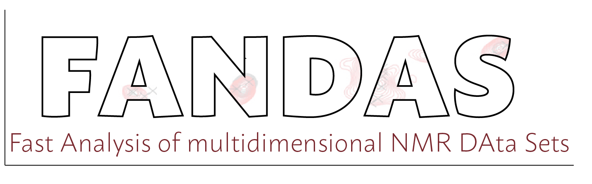

# FANDAS

[](https://opensource.org/licenses/Apache-2.0)
[](https://github.com/haddocking/fandas/actions/workflows/unittests.yml)
[](https://app.codacy.com/gh/haddocking/fandas/dashboard?utm_source=gh&utm_medium=referral&utm_content=&utm_campaign=Badge_coverage)
[](https://www.codacy.com/gh/haddocking/fandas/dashboard?utm_source=github.com&utm_medium=referral&utm_content=haddocking/fandas&utm_campaign=Badge_Grade)



## ATTENTION

The publication of [FANDAS](https://doi.org/10.1007/978-1-4939-7386-6_6) refers to its **original release** available at <https://github.com/siddarthnarasimhan/FANDAS_2.0>.

The present code contains changes made to the original code base and might not reflect the description given in its original publication.

**We are currently working on extending this live version with examples, detailed user documentation and explaination of each term used in the input file.**

## Web Service

This tool is also available as a web-service! Check it out at [wenmr.science.uu.nl/fandas](https://wenmr.science.uu.nl/fandas)

## Introduction

**F**ast **AN**lysis of multidimensional NMR **DA**ta **S**ets (**FANDAS**) is an analysis tool built on Python to predict peaks in multidimensional NMR experiments on proteins.

**FANDAS** accepts a variety of inputs, with the protein sequence being the only minimum required input. The output generated by FANDAS can be opened using the NMR visualization software SPARKY.

## Installation

```text
pip install fandas
fandas -h
```

See the [Example directory](https://github.com/haddocking/fandas/tree/main/example) for an usage example.

## Citation

- Narasimhan, S., Mance, D., Pinto, C., Weingarth, M., Bonvin, A. M. J. J. & Baldus, M. [Rapid Prediction of Multi-dimensional NMR Data Sets Using FANDAS](https://doi.org/10.1007/978-1-4939-7386-6_6). Methods in Molecular Biology 111–132 (2017). doi:10.1007/978-1-4939-7386-6_6
